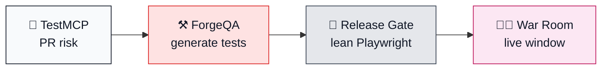

<p align="center">
  <a href="https://www.linkedin.com/in/analyticsrb">
    
  </a>
  <a href="https://github.com/ramonacraft">
    
  </a>
  <a href="#-what-i-build-in-public">
    
  </a>
</p>

---

## 👩‍💻 About Me

```python
class DeliveryLeader:
    def __init__(self):
        self.name = "Ramona Bonitatis"
        self.role = "Engineering & Delivery Leadership"
        self.focus = "AI Transformation · QA Engineering"
        self.location = "North Los Angeles 🌴"
        self.platforms = ["Web", "iOS", "Android", "CTV"]

    def skills(self):
        return {
            "day_to_day": ["Cursor", "Claude", "Playwright", "MCP", "Jira"],
            "delivery": ["Release judgment", "P0-P3 focus", "CI/CD gates"],
            "building": ["TestMCP", "ForgeQA", "Release Gate Lab", "War Room"],
            "learning": ["Databricks", "Prompt evals", "RAG", "LangGraph"],
        }

    def how_i_work(self):
        return [
            "Automate the rinse-and-repeat",
            "Keep humans on edge cases + judgment",
            "Lead with visuals so teams align fast",
            "Ship practical AI systems, not hype",
        ]
```

<p align="center">
  
</p>

### 🎯 Quick Snapshot

<table>
  <tr>
    <td>📍</td>
    <td><b>Based in</b></td>
    <td>North Los Angeles</td>
  </tr>
  <tr>
    <td>💼</td>
    <td><b>Focus</b></td>
    <td>Engineering & Delivery Leadership · AI Transformation · QA Engineering</td>
  </tr>
  <tr>
    <td>🔥</td>
    <td><b>Already building with</b></td>
    <td>Cursor, Claude, Playwright, MCP, Azure Pipelines, React/TypeScript</td>
  </tr>
  <tr>
    <td>🌱</td>
    <td><b>Currently learning</b></td>
    <td>Databricks, prompt eval frameworks, RAG / vector search, LangGraph</td>
  </tr>
  <tr>
    <td>🎯</td>
    <td><b>Next up</b></td>
    <td>Deeper TypeScript, Docker, stronger CI/CD, Andrew Ng-style evals</td>
  </tr>
  <tr>
    <td>💡</td>
    <td><b>Philosophy</b></td>
    <td>Automate the rinse-and-repeat. Keep humans on judgment.</td>
  </tr>
  <tr>
    <td>🤝</td>
    <td><b>Works with</b></td>
    <td>Engineering · Product · Project · QA Engineering · BI (Analytics)</td>
  </tr>
</table>

<p align="center">
  <i>"10+ years across web, iOS, Android, and CTV — shipping fast with judgment, learning in public, and building systems teams can actually run."</i>
</p>

---

## 🚀 What I build in public

These projects show how I think about Agile, shipping fast, release risk, live windows, and AI-assisted **QA Engineering** — a mix of project management, technical integration, QA Engineering practices, and a developer mindset.

| | Project | What it is |
|:--:|:--|:--|
| 👩‍💻 | **[Live Event War Room](https://github.com/ramonacraft/live-event-war-room)** | Live-event ops board + living runbook (real signals + Healthy → Incident) |
| 🚦 | **[Release Gate Lab](https://github.com/ramonacraft/release-gate-lab)** | Lean Playwright gate + go/no-go dashboard · [live demo](https://release-gate-lab.vercel.app/) |
| 🧪 | **[TestMCP](https://github.com/ramonacraft/testmcp)** | PR changes → risk-ranked P0–P3 test plan (MCP + dashboard) |
| ⚒️ | **[ForgeQA](https://github.com/ramonacraft/forgeqa)** | Local-first AI → reviewable Playwright from a plain-English goal |

## 🔀 How the work connects



`PR risk → test generation → lean gate → live window view`

---

## 🛠️ Tech Stack & Tools

<div align="center">

### 💻 Languages & platforms

<p>
  
</p>

### ✅ Working with now

<p>
  
  
  
  
  
  
  
  
  
  
  
  
</p>

### 🌱 Learning next

<p>
  
  
  
  
  
  
  
</p>

Inspired by **Andrew Ng** and DeepLearning.AI — practical AI systems, evals, and building with judgment, not hype.

</div>

---

## 💡 How I Work

| | |
|:--|:--|
| 🔁 **Automate the repeat** | Keep humans on edge cases, validating AI agent work, and release judgment. |
| 🎯 **Trusted suites** | Prefer small P0–P3 suites over giant suites that quietly get deprioritized. |
| 📊 **Fresh priorities** | Quarterly reviews with Product and Business Intelligence mapped to KPIs. |
| 🎨 **Visual first** | Boards, flows, and dashboards over long walls of text. |
| 📚 **Always learning** | New skills and tools, then put them to work with the team. Monitor token usage, optimize for AI agent loops, and prompt less. |

## ✨ Currently

- 🚀 Building public portfolio labs that mirror real release and live-ops decisions
- 🧪 Experimenting with building tools and working through tutorials
- 🧩 Solving practical problems in Agile workflows with AI-assisted **QA Engineering**
